# Face Comparison — Active Liveness Detection

แอป Flutter สำหรับทดลองตรวจสอบว่าใบหน้าหน้ากล้องเป็นบุคคลจริง
หรือเป็นการนำเสนอผ่านภาพถ่าย หน้าจอ และวิดีโอที่บันทึกไว้ โดยประมวลผลบนอุปกรณ์
(on-device) และใช้ active challenge หลายรูปแบบร่วมกัน

แอปนี้ทำหน้าที่เป็น consumer/example ของแพ็กเกจ `active_face_liveness`
ผ่าน local path dependency ระบบกล้องและ anti-spoof จึงอยู่ในแพ็กเกจเพียงชุดเดียว
และแอปอ่านผลผ่าน `LivenessResult` กับ `LivenessEvidence` แบบ typed

ระบบนี้ไม่ได้ตัดสินจาก face mesh หรือการพบใบหน้าเพียงอย่างเดียว แต่ให้ผู้ใช้:

1. อยู่ในระยะเริ่มต้นที่กำหนด
2. ขยับใบหน้าเข้ามาใกล้กล้อง
3. ตอบสนองต่อรหัสแสง RGBW แบบสุ่ม
4. กระพริบตาหรือหรี่ตาระหว่างแสงสีขาว
5. หันศีรษะสองด้านและค้างด้านละ 1 วินาที
6. ผ่านเงื่อนไข anti-spoof และหลักฐานรวมทั้งหมด

เมื่อสแกนเสร็จ แอปจะแสดงผลการตรวจสอบและภาพเต็มเฟรมที่ชัดที่สุดซึ่งคัดเลือกไว้
ระหว่างการสแกน

> โครงการนี้เป็น prototype สำหรับการทดลอง ไม่ใช่ระบบ Presentation Attack
> Detection (PAD) ที่ผ่านการรับรอง และไม่ควรใช้เป็นหลักฐานยืนยันตัวตนเพียงอย่างเดียว
> ในระบบที่มีความเสี่ยงสูง

## ความสามารถหลัก

- ตรวจจับใบหน้า, bounding box, head pose, face mesh 468 จุด และสถานะดวงตา
- ตรวจหาโทรศัพท์ โทรทัศน์ แล็ปท็อป และหนังสือที่อาจใช้แสดงภาพปลอม
- ตรวจระยะใบหน้าจากสัดส่วนความกว้างใบหน้าต่อภาพกล้อง
- ปรับความสว่างแอปเป็น 100% ชั่วคราวสำหรับ RGBW challenge
- สุ่มลำดับสีแดง เขียว น้ำเงิน และขาวใหม่ในแต่ละรอบ
- ตรวจการสะท้อนของสีหลายบริเวณบนใบหน้า
- ตรวจการกระพริบตาหรือหรี่ตาระหว่างแสงขาว
- ตรวจการหันศีรษะสองด้านพร้อม parallax จากจมูกและแก้ม
- ตรวจความหลากหลายของเฟรมและลำดับเฟรมซ้ำที่คล้าย replay
- คัดเลือกภาพเต็มเฟรมที่ชัดที่สุดโดยไม่บันทึกลง Gallery
- คืนค่าความสว่างหน้าจอเมื่อสแกนจบ ยกเลิก หรือออกจากหน้าสแกน

## เทคโนโลยีที่ใช้

| ส่วน | หน้าที่ |
| --- | --- |
| `camera` | รับภาพจากกล้องหน้าแบบต่อเนื่อง |
| `face_detection_tflite` | ตรวจใบหน้า, mesh, head pose และค่าการเปิดตา |
| `object_detection` | ตรวจวัตถุที่อาจเป็นสื่อสำหรับนำเสนอภาพปลอม |
| `screen_brightness` | เพิ่มและคืนค่าความสว่างหน้าจอ |
| `flutter_litert` | ช่วยจัดรูปแบบและหมุนข้อมูลเฟรมกล้อง |

การตรวจหลักทำบนอุปกรณ์ ไม่ต้องส่งภาพไปยังเซิร์ฟเวอร์

## ขั้นตอนการทำงาน

### ด่าน 1 — ตรวจใบหน้าในระยะเริ่มต้น

- เปิดกล้องหน้าและโหลดโมเดลตรวจใบหน้า/วัตถุ
- ต้องพบใบหน้าที่มีความมั่นใจเพียงหนึ่งใบ
- ใบหน้าต้องมีความกว้างประมาณ 20%–42% ของภาพกล้อง
- ต้องอยู่ในตำแหน่งที่ยอมรับได้ต่อเนื่องหลายเฟรม
- ตรวจหา `cell phone`, `tv`, `laptop` และ `book`
- หากพบสื่อที่น่าสงสัยต่อเนื่อง ระบบจะไม่อนุญาตให้ไปด่านถัดไป

ด่านนี้ยืนยันเพียงว่า “พบใบหน้าในสภาพแวดล้อมที่ยอมรับได้”
ยังไม่สามารถยืนยันว่าเป็นบุคคลจริงได้ด้วยตัวมันเอง

### ด่าน 2 — ขยับเข้ามาใกล้และเตรียมแสง

- ขยายกรอบและขอให้ผู้ใช้ขยับใบหน้าเข้ามาใกล้
- รับใบหน้าที่มีความกว้างประมาณ 50%–90% ของภาพกล้อง
- ตรวจความสว่างและสัดส่วนแสงระหว่างใบหน้ากับพื้นหลัง
- พื้นหลังสีขาวหรือสีสว่างไม่ถูกนับเป็นแสงจ้าโดยอัตโนมัติ
- แจ้งเตือน backlight เมื่อพื้นหลังสว่างมากพร้อมกับใบหน้ามืดจริงต่อเนื่องหลายเฟรม
- เก็บ pre-calibration และ baseline เพื่อชดเชยกล้อง/สภาพแสงของแต่ละเครื่อง

### ด่าน 3 — RGBW และดวงตา

ระบบเพิ่มความสว่างของแอปเป็น 100% และฉายสี 4 สีต่อเนื่องรวม 2 วินาที:

| สี | ระยะเวลา | ความเข้ม |
| --- | ---: | ---: |
| แดง | 400 ms | 100% |
| เขียว | 400 ms | 100% |
| น้ำเงิน | 400 ms | 100% |
| ขาว | 800 ms | 100% |

- ลำดับ RGBW ถูกสุ่มใหม่ทุกการสแกน แต่ความเข้มของทุกสีคงที่ 100%
- ไม่มีช่วงมืดคั่นระหว่างสี เพื่อลดเวลา challenge ให้เหลือ 2 วินาที
- เก็บค่าสีจากใบหน้าโดยรวม หน้าผาก แก้มซ้าย แก้มขวา และจมูก
- ตรวจว่าการเปลี่ยนแปลงของสีบนแต่ละบริเวณสัมพันธ์กับรหัสสีที่ฉายจริง
- ต้องพบการตอบสนองอย่างน้อย 2 จาก 3 สี RGB
- ระหว่างแสงขาว ระบบตรวจการกระพริบตาหรือหรี่ตาแบบไม่บอกล่วงหน้า
- ตรวจทั้ง eye-open probability และ Eye Aspect Ratio จาก face mesh
- การกระพริบที่เริ่มก่อนแสงขาวจะไม่ถูกนับเป็นคำตอบของ challenge
- ถ้าใบหน้าออกนอกระยะหรือเก็บตัวอย่างไม่ทัน deadline ระบบจะหยุดรอบนั้น

ค่าการสะท้อนแสงขาวใช้เป็นข้อมูลประกอบ ไม่ใช่เงื่อนไขตัดสินเพียงค่าเดียว
เพราะห้องที่สว่างมากอาจทำให้กล้องไม่มี exposure headroom เพิ่มเติม

### ด่าน 4 — หันศีรษะสองด้าน

- เก็บค่าหน้าตรงหลายเฟรมเป็น neutral reference
- ขอให้หันไปด้านหนึ่งและค้างต่อเนื่อง 1 วินาที
- แสดงเวลานับถอยหลังจนค้างครบ แล้วให้กลับมามองตรง
- ขอให้หันไปด้านตรงข้ามและค้างอีก 1 วินาที
- หากกลับมามองตรงเร็วเกินไป จะเริ่มเก็บเฉพาะด้านปัจจุบันใหม่
- ใช้ค่ากลางของหลายเฟรมเพื่อลดผลจาก landmark ที่สั่น
- ตรวจว่าจมูกและแก้มเคลื่อนที่สัมพันธ์กับทิศทางการหันแบบสามมิติ
- ตรวจ temporal parallax เพื่อแยกการหันศีรษะออกจากการเลื่อนภาพแบน

### ด่าน 5 — รวมผลและแสดงหน้าสรุป

ระบบตรวจเงื่อนไขบังคับและคำนวณคะแนนหลักฐาน anti-spoof
จากนั้นจึงตัดสินเป็น `realPerson` หรือ `photo`

ก่อนกลับหน้าหลัก ระบบจะ:

1. คืนค่าความสว่างหน้าจอ
2. หยุด image stream ของกล้อง
3. หมุนและ mirror ภาพที่เลือกไว้ให้ตรงกับ preview
4. ลดขนาดภาพให้ด้านยาวไม่เกิน 800 พิกเซลโดยรักษาสัดส่วน
5. เข้ารหัสเป็น PNG ในหน่วยความจำ
6. ส่งผลและภาพกลับไปแสดงในหน้าสรุป

## Flow การทำงาน

```mermaid
flowchart TD
    A["กดเริ่มสแกน"] --> B["ขอสิทธิ์กล้องและเปิดกล้องหน้า"]
    B --> C{"โหลด Face Detector และ Object Detector สำเร็จ?"}
    C -- "ไม่สำเร็จ" --> X["จบด้วยเหตุผลผิดพลาด"]
    C -- "สำเร็จ" --> D["ด่าน 1: ตรวจใบหน้าในระยะ 20%–42%"]

    D --> E{"พบใบหน้าเดียวและไม่พบสื่อน่าสงสัยต่อเนื่อง?"}
    E -- "ไม่ผ่าน" --> D
    E -- "ผ่าน" --> F["ด่าน 2: ขยับใบหน้าเข้าใกล้ 50%–90%"]

    F --> G{"ใบหน้าชัด ระยะถูกต้อง และไม่เกิด backlight รุนแรง?"}
    G -- "ไม่ผ่าน" --> F
    G -- "ผ่าน" --> H["Pre-calibration และเก็บ baseline"]

    H --> I["เพิ่มความสว่างแอปเป็น 100%"]
    I --> J["ด่าน 3: ฉาย RGBW แบบสุ่มต่อเนื่อง 2 วินาที"]
    J --> K["ตรวจสีหลายบริเวณ + blink/squint ระหว่างแสงขาว"]
    K --> L{"สีผ่าน ≥ 2/3, ดวงตาผ่าน, เวลาและ correlation ผ่าน?"}
    L -- "ไม่ผ่าน" --> X
    L -- "ผ่าน" --> M["ด่าน 4: เก็บ neutral pose"]

    M --> N["หันด้านแรกและค้าง 1 วินาที"]
    N --> O{"ค้างครบแล้วกลับมามองตรง?"}
    O -- "ยังไม่ครบ" --> N
    O -- "ครบ" --> P["หันด้านตรงข้ามและค้าง 1 วินาที"]
    P --> Q{"ค้างครบ + motion coherence + parallax ผ่าน?"}
    Q -- "ไม่ผ่าน" --> X
    Q -- "ผ่าน" --> R["รวมหลักฐาน anti-spoof"]

    R --> S{"เงื่อนไขบังคับและคะแนนรวมผ่านทั้งหมด?"}
    S -- "ไม่ผ่าน" --> X
    S -- "ผ่าน" --> T["ยืนยันเป็นบุคคลจริง"]

    X --> U["คืนค่าความสว่างและหยุดกล้อง"]
    T --> U
    U --> V["เข้ารหัสภาพเต็มเฟรมที่ชัดที่สุด"]
    V --> W["แสดงผลและภาพในหน้าสรุป"]
```



## เงื่อนไขบังคับกับคะแนน anti-spoof ต่างกันอย่างไร

ระบบใช้การตัดสินสองชั้น:

### 1. เงื่อนไขบังคับ (mandatory gates)

เงื่อนไขสำคัญต้องผ่านครบ เช่น:

- ตอบสนองต่อ RGB อย่างน้อย 2 จาก 3 สี
- กระพริบตาหรือหรี่ตาตรงกับช่วงแสงขาว
- ลำดับการตอบสนองอยู่ภายในเวลาที่กำหนด
- สีหลายบริเวณบนใบหน้าสัมพันธ์กับ challenge
- หันศีรษะครบสองด้าน
- motion coherence และ parallax ผ่าน
- ไม่พบหลักฐาน replay/frame loop ที่ชัดเจน

ถ้าเงื่อนไขบังคับข้อใดไม่ผ่าน ระบบจะไม่ยืนยันว่าเป็นบุคคลจริง
แม้คะแนนรวมจะสูง

### 2. คะแนนหลักฐานรวม (combined anti-spoof evidence)

คะแนนรวมใช้หลักฐานหลายชนิดเพื่อช่วยลดการตัดสินจากสัญญาณเดียว:

- ความสัมพันธ์ของสีตามเวลาในหลายบริเวณ
- ความหลากหลายของเฟรม
- texture ที่คล้ายจอภาพหรือ moiré
- การตอบสนองของดวงตา
- parallax/depth จากการหันศีรษะ
- หลักฐาน replay

คะแนนผ่านปัจจุบันคืออย่างน้อย `0.58` และยังต้องไม่มีข้อห้ามสำคัญ
ดังนั้นคะแนนรวมเป็น “หลักฐานเสริมประกอบกัน” ไม่ได้ใช้แทนเงื่อนไขบังคับ

## การตรวจภาพถ่าย หน้าจอ และวิดีโอ

ระบบใช้หลายกลไกร่วมกัน:

- Object detector ตรวจกรอบอุปกรณ์หรือสื่อที่ครอบใบหน้า
- ตรวจ high-frequency chroma/ลักษณะ moiré เป็นหลักฐานประกอบ
- ตรวจรหัส RGBW ที่สุ่มใหม่ในแต่ละรอบ
- ตรวจ blink/squint ที่เริ่มหลังแสงขาว
- ตรวจความสัมพันธ์ของสีแยกหลายบริเวณบนใบหน้า
- สร้าง brightness-normalized face hash แบบ 63 บิต
- ตรวจความหลากหลายของภาพและลูปเฟรมซ้ำ
- ตรวจการเคลื่อนไหวสามมิติจาก head pose และ parallax

Object detector ทำงานในช่วงตรวจระยะและช่วงหันศีรษะ
แต่พักระหว่างการเก็บ RGBW เพื่อให้การประมวลผลแสงต่อเนื่องทัน deadline

ไม่มีสัญญาณใดป้องกัน replay ได้สมบูรณ์เพียงลำพัง
ระบบจึงกำหนดให้ active challenge และหลักฐานหลายชนิดต้องสอดคล้องกัน

## การเลือกภาพที่ชัดที่สุด

ระบบไม่ได้ถ่ายภาพเพียงครั้งเดียวตอนจบ แต่ประเมินภาพผู้สมัครระหว่าง:

- ช่วงขยับเข้าใกล้
- ช่วงเตรียมและเก็บ baseline
- ช่วงหันศีรษะเมื่อใบหน้ากลับมาอยู่ใน pose ที่ยอมรับได้

ระบบไม่เลือกภาพจากช่วงที่อยู่ไกล ช่วงฉายแสงสี หรือเมื่อพบสื่อน่าสงสัย
ภาพผู้สมัครต้อง:

- ลืมตาหรือมี Eye Aspect Ratio ที่ยอมรับได้
- มองค่อนข้างตรง
- มีขนาดใบหน้าและ exposure ที่เหมาะสม
- ไม่มี saturated pixels มากเกินไป

ความคมชัดให้น้ำหนักหลักจาก Laplacian focus energy และ gradient
ส่วน pose, ดวงตา, exposure, ขนาดใบหน้า และ mesh confidence
ใช้ช่วยตัดสินเมื่อภาพมีความคมใกล้เคียงกัน

เก็บไว้ในหน่วยความจำเพียงภาพที่ได้คะแนนดีที่สุด ภาพที่แสดงเป็นภาพเต็มเฟรม
ไม่ตัดเฉพาะใบหน้า และไม่เขียนลง Gallery หรือไฟล์ถาวรโดย prototype นี้

## โครงสร้างโค้ด

```text
lib/
├── main.dart                         # จุดเริ่มแอปและ Theme
└── pages/
    └── home_page.dart                # เรียก package และแสดงหน้าสรุป
```

ระบบ liveness อยู่ที่:

```text
../../active_face_liveness/active_face_liveness/
```

และเชื่อมผ่าน `pubspec.yaml`:

```yaml
dependencies:
  active_face_liveness:
    path: ../../active_face_liveness/active_face_liveness
```

## การติดตั้งและรัน

ต้องมี Flutter SDK และอุปกรณ์ Android/iOS ที่มีกล้องหน้า:

```bash
flutter pub get
flutter run
```

ตรวจคุณภาพโค้ด:

```bash
flutter analyze
flutter test
```

สร้าง Android debug APK:

```bash
flutter build apk --debug
```

## ค่าหลักใน prototype ปัจจุบัน

| ค่า | การตั้งค่า |
| --- | ---: |
| Scan timeout | 75 วินาที |
| ระยะเริ่มต้น | 20%–42% ของความกว้างภาพ |
| ระยะใกล้ | 50%–90% ของความกว้างภาพ |
| RGB pulse | สีละ 400 ms |
| White pulse | 800 ms |
| RGBW challenge รวม | 2 วินาที |
| ความเข้มทุกสี | 100% |
| หันศีรษะ | ด้านละ 1 วินาที |
| Anti-spoof score ขั้นต่ำ | 0.58 |
| ภาพสรุป | ด้านยาวไม่เกิน 800 px |

ค่าพวกนี้ควรทดสอบและปรับเทียบกับรุ่นโทรศัพท์ กล้องหน้า สีผิว
อุปกรณ์เสริม และสภาพแสงจริงก่อนนำไปใช้ใน production

## ข้อจำกัดและข้อควรระวัง

- กล้อง RGB ทั่วไปไม่มีข้อมูล depth/IR จริงเหมือนฮาร์ดแวร์เฉพาะ
- วิดีโอ replay ที่เตรียมมาอย่างซับซ้อนอาจเลียนแบบพฤติกรรมบางส่วนได้
- กล้องแต่ละรุ่นมี auto-exposure, white balance และ FPS ต่างกัน
- แว่นตา หน้าม้า การหลับตาไม่สนิท และแสงจัดอาจกระทบ eye signal
- Object detector อาจเกิด false positive จึงต้องอาศัยหลายเฟรมและตำแหน่งกรอบ
- ระบบ production ควรมี server-generated nonce/session challenge
- งานยืนยันตัวตนความเสี่ยงสูงควรใช้ PAD SDK ที่ผ่านการรับรอง
  หรือกล้อง depth/IR

ก่อนจัดเก็บหรือส่งภาพผู้ใช้ ต้องมีข้อความยินยอม นโยบายความเป็นส่วนตัว
ระยะเวลาการเก็บรักษา และมาตรการรักษาความปลอดภัยที่เหมาะสม
